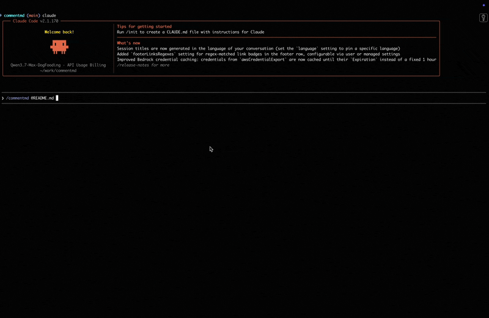

# commentmd

[](https://github.com/zxl-lxz/commentmd/actions/workflows/test.yml)

Highlight-and-comment on a local Markdown file in the browser. Submit, and the tool writes a structured JSON of your comments — ready for an AI agent to read and respond to.



Designed as an agent **skill**: when an agent generates a `.md` (design doc, tech spec, PR description) and needs human review, it invokes `commentmd`, waits for your feedback, and reads back the JSON.

_[中文说明](./README.zh.md)_

## Why

Agents write a lot of Markdown. Getting human feedback back into the agent is usually one of:

- Copy-pasting into chat — loses location context.
- Editing the file with tracked-change markup (CriticMarkup) — awkward.
- Cloud annotation tools (Hypothes.is, Google Docs) — heavy, requires accounts.

`commentmd` does the smallest thing that works: opens a browser tab, lets you drag-select text and type a comment, saves the comments as JSON next to the file. Zero dependencies beyond the Python standard library and one CDN script (`marked`).

## Install

The easiest way — via [`npx skills`](https://github.com/vercel-labs/skills):

```bash
npx skills add https://github.com/zxl-lxz/commentmd
```

Or clone anywhere and symlink the skill directory:

```bash
git clone https://github.com/zxl-lxz/commentmd.git ~/code/commentmd
mkdir -p ~/.agents/skills
ln -sfn ~/code/commentmd/skills/commentmd ~/.agents/skills/commentmd
```

Requires Python 3.9+.

## Usage

### From the terminal

```bash
python3 skills/commentmd/scripts/serve.py path/to/plan.md
```

Your browser opens. Select text → click **+ 评论** → type a comment → save. Repeat. Click **完成评论** when done. The tool writes `path/to/plan.comments.json` next to the source and exits.

### As an agent skill

If installed under `~/.agents/skills/commentmd/`, agents that support the slash-command skill convention can invoke it as:

```
/commentmd path/to/plan.md
```

The agent then reads `path/to/plan.comments.json` and responds to each comment.

### Offline / headless

Write a standalone HTML instead of starting a server:

```bash
python3 skills/commentmd/scripts/serve.py path/to/plan.md --static /tmp/review.html
```

Open the HTML in a browser. Submitting downloads the JSON as a file.

## Output

```json
{
  "schema_version": 1,
  "md_file": "/abs/path/plan.md",
  "md_sha256": "abc...",
  "md_changed_during_review": false,
  "created_at": "2026-07-01T10:00:00Z",
  "comment_count": 2,
  "comments": [
    {
      "id": "c1",
      "quote": "Store events in MySQL",
      "prefix": "In our storage layer, we ",
      "suffix": ", replicated across ...",
      "comment": "Why not PostgreSQL? JSONB support is better.",
      "created_at": "2026-07-01T10:00:12Z"
    }
  ]
}
```

Each comment carries a `quote` plus 32-char `prefix` / `suffix` anchors — a simplified [Web Annotation TextQuoteSelector](https://www.w3.org/TR/annotation-model/#text-quote-selector). The agent can locate the quote in the (possibly slightly modified) original file via fuzzy match on this triple.

`md_changed_during_review: true` means the file was modified between server start and submit — the agent should treat comments with care.

## Features

- Drag-select any text (paragraphs, list items, table cells, code blocks) — comment on it.
- Persistent yellow highlights on every commented region.
- Sticky sidebar always visible, auto-scrolls to newest comment.
- Comment CRUD; ids renumber to `c1..cN` on delete.
- Detects if the source file changes during review (sha256 compare).
- Static HTML export for headless / offline use.
- No runtime dependencies other than a CDN-hosted `marked` (the frontend needs an internet connection to fetch it).

## CLI reference

```
python3 skills/commentmd/scripts/serve.py <md_path> [OPTIONS]

Options:
  --port N           Starting port (default 3118). Scans up to 3128.
  --out PATH         Output JSON path (default: <md>.comments.json).
  --static HTML      Write a standalone HTML and exit (no server).
  --no-browser       Don't auto-open the browser.
```

Server binds to `127.0.0.1` only.

## Development

```bash
python3 -m unittest discover -s tests -v
```

14 unit tests, all stdlib.

## Design

Design rationale, architecture, and trade-offs: [docs/design.md](./docs/design.md).

## Limitations

- The bundled `marked` is loaded from CDN, so `--static` mode requires internet on first render.
- `/api/finish` is authenticated by binding to `127.0.0.1` plus an `Origin` check; it is not intended for multi-user or shared environments.
- The frontend uses DOMPurify to strip event handlers from Markdown-rendered HTML. If you disable this (don't), you inherit any XSS in your Markdown source.

## License

[MIT](./LICENSE)
